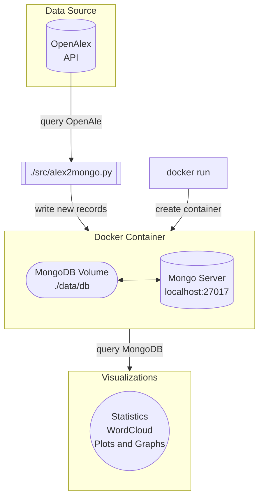

# EnviroMetaAnalysis

The EnviroMetaAnalysis queries journal articles published between 2013-2023 from a subset of journals related to the field of Environmental Sciences to explore the trends in environmental research around the world. These metadata were sourced from [OpenAlex](https://openalex.org/), stored on a [MongoDB](https://mongodb.com/) server, and analyzed with Python using [Jupyter](https://jupyter.org) notebooks. 

This project is completed as part of the Indiana University FADS Summer 2023 program.

## Program Operation

The `src` folder contains a script to query journal article metadata from OpenAlex and write them into local MongoDB server as a document for each article. To save some time and start working with this dataset directly, one can undertake the following steps:

1. [Install Docker](https://docs.docker.com/get-docker/)
2. Acquire `db.tar.gz` from project admin and save it to the `./data/` directory
3. From the `./data/` directory run the following command to extract the MongoDB database files: 
```shell
tar xzf db.tar.gz db
```
4. Build the container with the following command: 

```go
docker run -d --name mongodb_fads \
-v <absolute-path-to-repo>/EnviroMetaAnalysis/data/db:/data/db \
-p 27017:27017 mongo:latest
```

This will create and run a Docker container running MongoDB with the queried data from OpenAlex. The data is reachable at this URI: `mongodb://localhost:27017`, in the `journals` collection of the `OpenAlexEnvironmental` database. 

## Conceptual Overview




