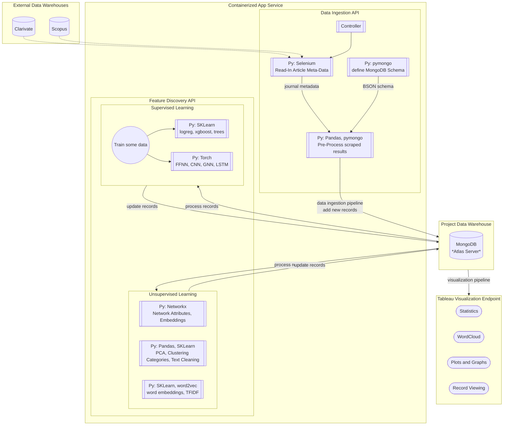
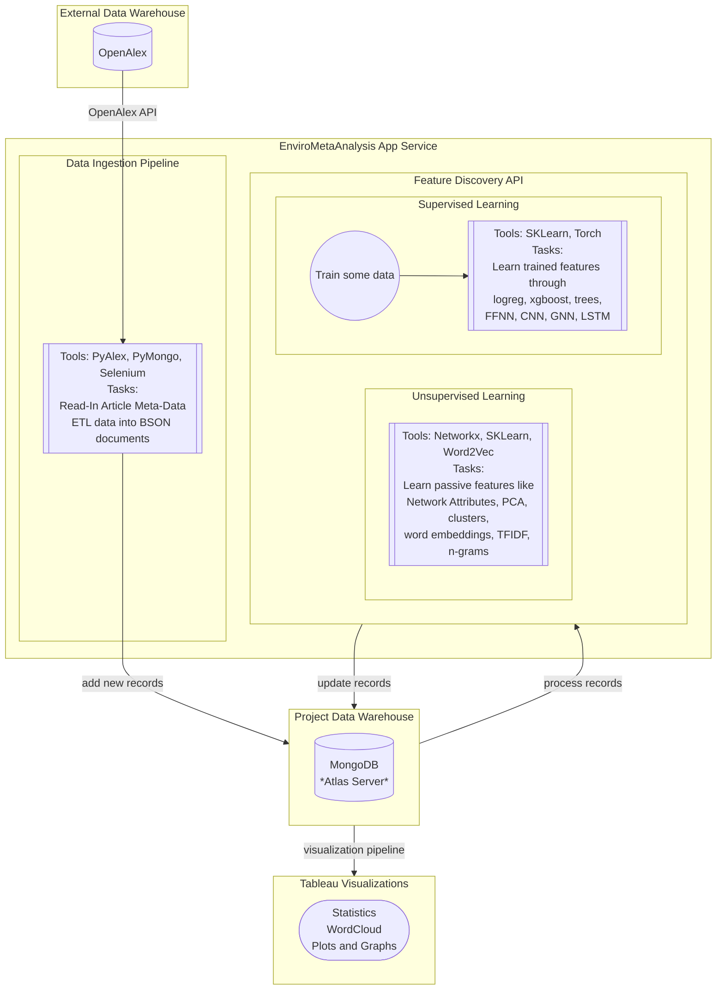

# 1. Initial thought on an application design architecture

MG

```mermaid
flowchart TB
    
    subgraph G["External Data Warehouses"]
        clar[("Clarivate")]
        scopus[("Scopus")]
    end

    clar-.-> sel
    scopus-.->sel

    subgraph A["Data Ingestion API"]
        ctrl[["Controller"]]
        sel[[Py: Selenium\nRead-In Article Meta-Data]]
        prep[[Py: Pandas, pymongo\nPre-Process scraped results]]
        schema[[Py: pymongo\ndefine MongoDB Schema]]
        sel--journal metadata-->prep
        schema--BSON schema-->prep
        ctrl-->sel
    end

    prep--data ingestion pipeline\nadd new records-->B    
    
    subgraph B["Project Data Warehouse"]
        mongo[("MongoDB\n*Atlas Server*")]
    end
    
    B--visualization pipeline-->C;

    subgraph C["Tableau Visualization Endpoint"]
        stats([Statistics])
        word([WordCloud])
        graphs([Plots and Graphs])
        records([Record Viewing])
    end

    B--process records-->D--update records-->B;
    B--process records-->E--update records-->B; 

    subgraph D["Unsupervised Learning"]
        net[["Py: Networkx\nNetwork Attributes, Embeddings"]]
        clust[["Py: Pandas, SKLearn\nPCA, Clustering Categories, Text Cleaning"]]
        text[["Py: SKLearn, word2vec\n word embeddings, TFIDF"]]
    end

    subgraph E["Supervised Learning"]
        ml[["Py: SKLearn\nlogreg, xgboost, trees"]]
        nn[["Py: Torch\nFFNN, CNN, GNN, LSTM"]]
        train(("Train some data"))
        train-->ml
        train-->nn
    end

    subgraph F["Feature Discovery API"]
        D
        E
    end

    subgraph H["Containerized App Service"]
        A
        F
    end

```

# 2. Revised 5/30/2023

MG, MV, PG

```mermaid
flowchart TB
    
    subgraph G["External Data Warehouse"]
        oa[("OpenAlex")]
    end

    oa--OpenAlex API--> inbound
    
    subgraph A["Data Ingestion Pipeline"]
        inbound[[Tools: PyAlex, PyMongo, Selenium\nTasks:\nRead-In Article Meta-Data\nETL data into BSON documents]]
    end

    inbound--add new records-->B    
    
    subgraph B["Project Data Warehouse"]
        mongo[("MongoDB\n*Atlas Server*")]
    end
    
    B--visualization pipeline-->C;

    subgraph C["Tableau Visualizations"]
        stats(["Statistics\nWordCloud\nPlots and Graphs"])
    end

    B--process records-->F--update records-->B;

    subgraph D["Unsupervised Learning"]
        net[["Tools: Networkx, SKLearn, Word2Vec\nTasks:\nLearn passive features like\nNetwork Attributes, PCA, clusters,\nword embeddings, TFIDF, n-grams"]]
    end

    subgraph E["Supervised Learning"]
        direction LR
        ml[["Tools: SKLearn, Torch\nTasks:\nLearn trained features through\nlogreg, xgboost, trees,\nFFNN, CNN, GNN, LSTM"]]
        train(("Train some data"))
        train-->ml
    end

    subgraph F["Feature Discovery API"]
        D
        E
    end

    subgraph H["EnviroMetaAnalysis App Service"]
        A
        F
    end
```

